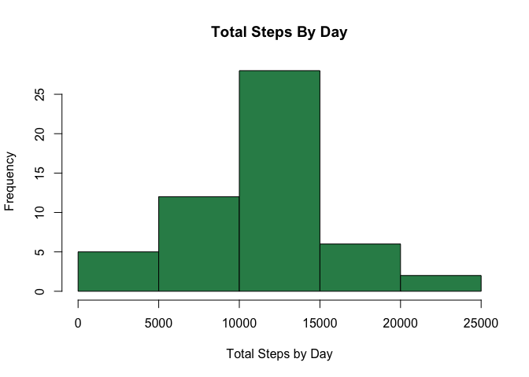
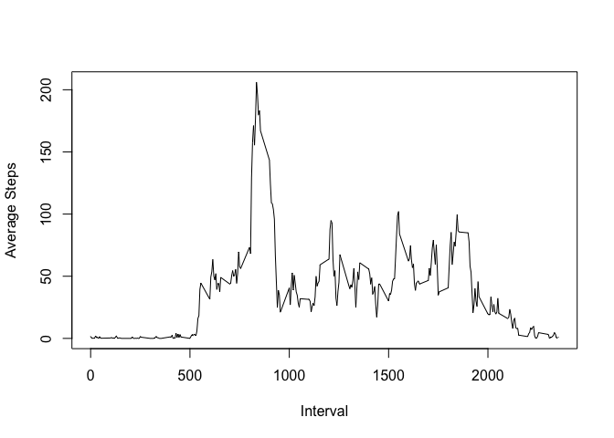
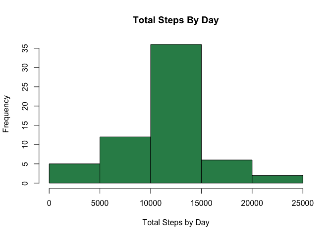
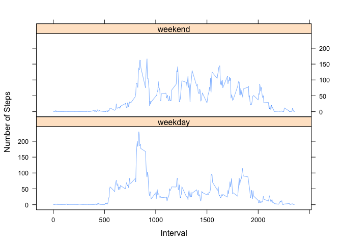

## Loading and preprocessing the data

The code assumes that you have forked and cloned a copy of the repository to your local machine.
You must set the r session working directory to this location.

The following code checks if the file "activity.zip"" exists. If it does, then it will unzip the file and read it into a variable called activity_data.


```r
if (file.exists("activity.zip")) {
        unzip("activity.zip")
} else {
        stop("The activity data file is missing. Check your working directory.")
}

activity_data <- read.csv("./activity.csv", header=TRUE, sep = ",")
```

To gain a better understanding of the data set, we can check the contents of the file:


```r
head(activity_data)
```

```
##   steps       date interval
## 1    NA 2012-10-01        0
## 2    NA 2012-10-01        5
## 3    NA 2012-10-01       10
## 4    NA 2012-10-01       15
## 5    NA 2012-10-01       20
## 6    NA 2012-10-01       25
```

```r
str(activity_data)
```

```
## 'data.frame':	17568 obs. of  3 variables:
##  $ steps   : int  NA NA NA NA NA NA NA NA NA NA ...
##  $ date    : Factor w/ 61 levels "2012-10-01","2012-10-02",..: 1 1 1 1 1 1 1 1 1 1 ...
##  $ interval: int  0 5 10 15 20 25 30 35 40 45 ...
```

```r
unique(activity_data$date)
```

```
##  [1] 2012-10-01 2012-10-02 2012-10-03 2012-10-04 2012-10-05 2012-10-06
##  [7] 2012-10-07 2012-10-08 2012-10-09 2012-10-10 2012-10-11 2012-10-12
## [13] 2012-10-13 2012-10-14 2012-10-15 2012-10-16 2012-10-17 2012-10-18
## [19] 2012-10-19 2012-10-20 2012-10-21 2012-10-22 2012-10-23 2012-10-24
## [25] 2012-10-25 2012-10-26 2012-10-27 2012-10-28 2012-10-29 2012-10-30
## [31] 2012-10-31 2012-11-01 2012-11-02 2012-11-03 2012-11-04 2012-11-05
## [37] 2012-11-06 2012-11-07 2012-11-08 2012-11-09 2012-11-10 2012-11-11
## [43] 2012-11-12 2012-11-13 2012-11-14 2012-11-15 2012-11-16 2012-11-17
## [49] 2012-11-18 2012-11-19 2012-11-20 2012-11-21 2012-11-22 2012-11-23
## [55] 2012-11-24 2012-11-25 2012-11-26 2012-11-27 2012-11-28 2012-11-29
## [61] 2012-11-30
## 61 Levels: 2012-10-01 2012-10-02 2012-10-03 2012-10-04 ... 2012-11-30
```

From this first peek at the data, we can see that there are some NULL values for steps, and we have 61 days with no missing days in the data set. We know that dates are not stored as dates. This may be important later on if we need to do any date-based calculations.

## What is mean total number of steps taken per day?

We need to create a histogram of the total number of steps taken each day. For this, we need to calculate the total number of steps per day before creating the histogram.


```r
suppressMessages(library(dplyr))  # suppress warnings when loading packages
totalsteps <- aggregate(steps ~ date, data=activity_data, sum,na.rm= TRUE)
head(totalsteps)
```

```
##         date steps
## 1 2012-10-02   126
## 2 2012-10-03 11352
## 3 2012-10-04 12116
## 4 2012-10-05 13294
## 5 2012-10-06 15420
## 6 2012-10-07 11015
```

Now we can use this data to create the histogram:


```r
library(ggplot2)

hist(totalsteps$steps, col = "seagreen", main="Total Steps By Day", xlab = "Total Steps by Day")
```

<!-- -->

Calculate the mean total steps taken each day:


```r
mean(totalsteps$steps,na.rm= TRUE)
```

```
## [1] 10766.19
```

Calculate the median total steps taken each day:


```r
median(totalsteps$steps,na.rm= TRUE)
```

```
## [1] 10765
```

## What is the average daily activity pattern?

First we get the average steps by interval:


```r
avgsteps <- aggregate(steps ~ interval, data=activity_data, mean,na.rm= TRUE)
```

Using this data, we can now make a time series plot showing the average steps by 5-minute interval across all days:


```r
plot(avgsteps$interval, avgsteps$steps, type="l", xlab = "Interval", ylab = "Average Steps")
```

<!-- -->

Get the interval with the maximum number of steps:


```r
avgsteps[which.max(avgsteps$steps),]
```

```
##     interval    steps
## 104      835 206.1698
```


## Imputing missing values

First we calculate how many values are missing in our original data. I wanted to prove that it is only steps data which is missing, so I have extracted NAs for all columns:


```r
sapply(activity_data, function(x) sum(is.na(x)))
```

```
##    steps     date interval 
##     2304        0        0
```

Now we can impute the values for the missing data. I decided to use the mean for the interval across all days and use the impute function in the Hmisc package. 
I then created a new data set called filledData which contains a new column 'meansteps' with the mean value of all steps (including imputed steps) grouped by 5-minute intervals.


See http://r-statistics.co/Missing-Value-Treatment-With-R.html for information:

```r
suppressMessages(library(Hmisc))
suppressMessages(library(magrittr))

filledData <- activity_data %>%
                group_by(interval) %>%
                mutate(
                meansteps = impute(steps, mean)
        )
```

To make sure our figures are accurate, we can check that the mean from our previous average steps calculation is the same as the one we have just imputed:


```r
# New
mean(filledData$meansteps)
```

```
## [1] 37.3826
```

```r
# Previous
mean(avgsteps$steps)
```

```
## [1] 37.3826
```

Now we can make a new histogram of the total number of steps


```r
imputedtotalsteps <- aggregate(meansteps ~ date, data=filledData, sum,na.rm= TRUE)
hist(imputedtotalsteps$meansteps, col = "seagreen", main="Total Steps By Day", xlab = "Total Steps by Day")
```

<!-- -->

Calculate the mean and median total number of steps taken per day

```r
mean(imputedtotalsteps$meansteps)
```

```
## [1] 10766.19
```

```r
median(imputedtotalsteps$meansteps)
```

```
## [1] 10766.19
```

#### Conclusions

Do these values differ from the estimates from the first part of the assignment? What is the impact of imputing missing data on the estimates of the total daily number of steps?

The histogram does differ, as it has a higher number of steps due to the imputed values. However, the distribution of the steps in the second plot is a similar pattern to the first histogram. We can see that the mean is the same for both estimates, and the median values only differ very slightly:


```r
mean(totalsteps$steps,na.rm= TRUE) - mean(imputedtotalsteps$meansteps)
```

```
## [1] 0
```

```r
median(totalsteps$steps,na.rm= TRUE) - median(imputedtotalsteps$meansteps)
```

```
## [1] -1.188679
```

## Are there differences in activity patterns between weekdays and weekends?

We will use the filled data as per the instructions for the project.

First of all, we need to convert our date column into a date from a 61-level factor. Then we will create a new column which has 2 levels showing weekday and weekend. I used the weekdays() function for this as per the project description.


```r
filledData$date <- as.Date(filledData$date)

filledData$wkDay <- factor(ifelse (weekdays(filledData$date) %in% c("Saturday", "Sunday"), "weekend", "weekday"),
                                levels=c("weekend","weekday"))
```

Now calculate the average steps by interval and weekday/weekend:


```r
avgfilledsteps <- aggregate(meansteps ~ interval + wkDay, data=filledData, mean)
```

Finally we can create a panel plot which contains the number of steps by interval, split across weekday and weekend.


```r
library(lattice)
xyplot(meansteps ~ interval | factor(wkDay), avgfilledsteps, type="l", lwd=0.5, 
       index.cond=list(c(2,1)), # order the plots to have weekend first
       layout = c(1,2), 
       xlab = "Interval", 
       ylab = "Number of Steps") 
```

<!-- -->

#### Conclusions

On both weekdays and weekends, up until approximately the 500 mark, we can see very little activity. We can posit that the subjects are sleeping during this time.   
On the weekday chart, between approximately 550 - 850 interval marks, the number of steps is increased when compared with the same period on the weekend. Perhaps people are getting up and getting ready for work, while on the weekends, people are more inactive and/or get up later.  
There is a large spike on the qweekday chart just before the 1000 interval mark which might be attributed to subjects going to work. This does not happen on the weekend chart.  
Overall, the number of steps is higher on the weekend chart from the 1000 - 2000 interval marks, suggesting that the subjects are more active on the weekend than during weekdays.  
